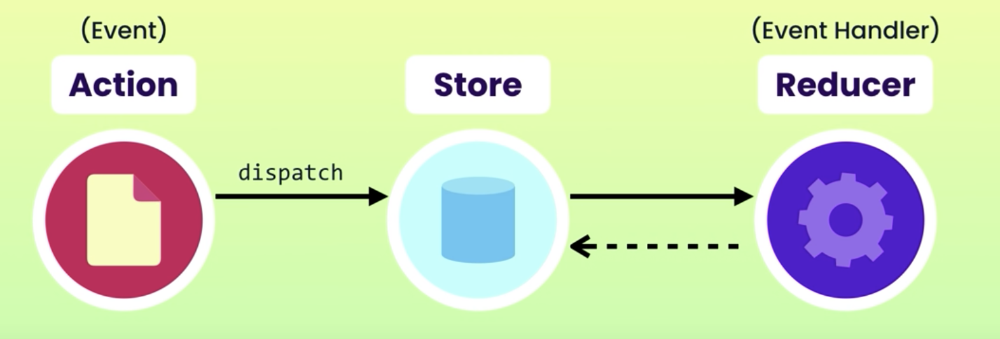

# Redux tutorial

The repo shows the result of the following tutorial:

[Youtube video](https://www.youtube.com/watch?v=poQXNp9ItL4)

The main goal is to start to use Redux with a simple example. 
The tutorial explains the concepts of ACTION, STORE and REDUCERS.


   

Use the console of your browser in order to display the result of the dispatches.


## Intallation

In the main folder

```shell
    npm install
```

To run the demo:

```shell
    npm start
```

Link in the browser: [http://localhost:9000/](http://localhost:9000/)
